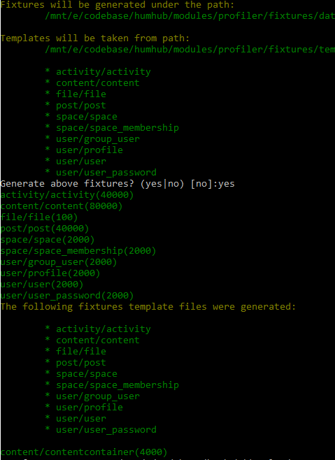

# HumHub Profiler

> ⚠ Do not install this module on a production environment!

This HumHub module can be used to emulate an active HumHub network with a certain amount of users, spaces and content.
This module uses yii faker library in order to generate partly random test data.

 - https://github.com/yiisoft/yii2-faker/blob/master/docs/guide/basic-usage.md
 - https://github.com/fzaninotto/Faker#fakerproviderdatetime
 
You can furthermore use this module for profiling purposes.

## Fixtures

### Users

- First user with id 1 is always in admin group with name `root`
- Other usernames are of format User<index>, so user with id 2 has username User1
- All user passwords are `test`

### Spaces

 - Space names are random
 
### Content

 - This module will generate post and related content created activities

### Generate fixture data

```
php yii profiler/fixture/generate-all
```



### Load fixture data

```
php yii profiler/fixture/load "*"
```

> Note: The execution of this command may take some time...

### Profiling

Set `SET GLOBAL query_cache_size = 0;` in your mysql db in order to test against non cached query times.

`SHOW VARIABLES LIKE 'query_cache_size';` should return a value of `0`.

#### Run profiler

```
php yii profiler/gallery/run
```

```
php yii profiler/gallery/run --count=200
```

## Further reading

 - https://github.com/yiisoft/yii2-faker/blob/master/docs/guide/basic-usage.md
 - https://github.com/fzaninotto/Faker#fakerproviderdatetime